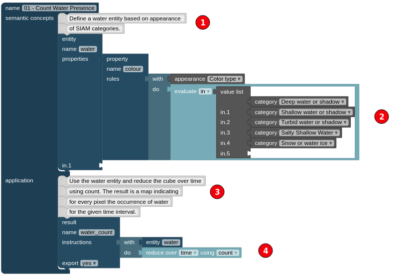

```{r setup, include=FALSE}
library(mapview)
library(raster)
knitr::opts_chunk$set(echo = TRUE)
r1 <- raster("data/water_count_id4375_3035.tif")
r2 <- raster("data/water_count_id4381_3035.tiff")
r3 <- raster("data/water_count_id4383_3035.tiff")
```


# Question N° 01

**Make yourself familiar with the system and the querying language**

According to the documentation in [https://manual.sen2cube.at/](https://manual.sen2cube.at/),
sen2cube is a data cube platform that permits realize queries without coding skills. The spatial processes that `sen2cube.at` offers to the users are:

- Semantic content-based image retrieval
- Cloud-free composite
- Time series
- Spatially disaggregated information
- etc.

To start to use `sen2cube.at` the user must have to have a user account. After logging the next interface is displayed:

<figure>
<center>
  <br>
  <caption>
    <strong>
      Figure 01: Main interface of sen2cube
    </strong>
  </caption>
</center>
</figure>

# Question N° 02

**Create a new model (or adjust an existing one) for a specific use-case and execute it in 3-4 areas within Austria (so-called inferences)**

One of the main features that sen2cube offers is that all the pixels have associated a unique category based on the Satellite Image Automatic Mapper (SIAM). Using this information we can select only the pixels related to "`water`" and count the presence of this category over time.

<figure>
<center>
  <br>
  <caption>
    <strong>
      Figure 02: Water Ocurrence
    </strong>
  </caption>
</center>
</figure>

The points **#1** and **#3** are the documentation, while point **#2** represent the SIAM classes. Finally, point **#4** applies a time reduction by "count".

The result of sen2cube can be seen in the following interactive maps.

**Crabensee**

```{r echo=FALSE}
suppressWarnings(
  suppressMessages(
    mapview(r1, layer.name="Crabensee")
  )
)
```

**Plescherken**

```{r echo=FALSE}
suppressWarnings(
  suppressMessages(
    mapview(r2, layer.name="Plescherken")
  )
)
```

**Langsee**

```{r echo=FALSE}
suppressWarnings(
  suppressMessages(
    mapview(r3, layer.name="Langsee")
  )
)
```


# Question N° 03

**Export the model as xml, create a document with a short description and screenshots  of the results of the inferences and submit it to blackboard.**

The water count model can be found [here]().