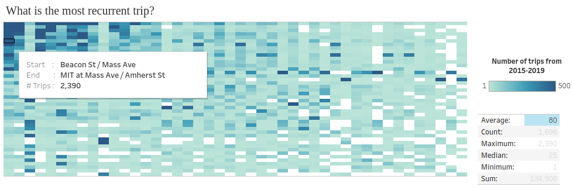
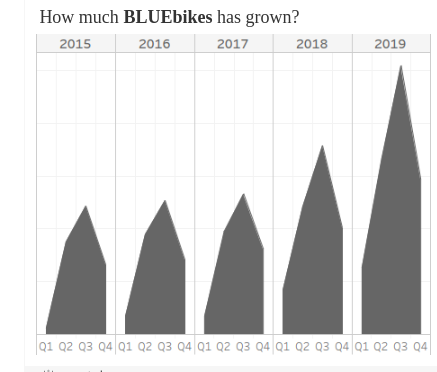
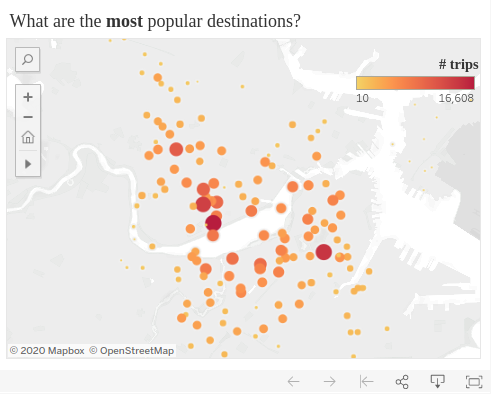

```{r setup, include=FALSE}
knitr::opts_chunk$set(echo = TRUE)
```

```{r htmlTemplate, echo=FALSE, warning=FALSE}
# Create the external file
img <- htmltools::img(src = "https://user-images.githubusercontent.com/16768318/96349562-be6c7700-10b0-11eb-973d-ce55906dcf7e.jpeg", 
               alt = 'logo', 
               width="10%",
               style = 'position:absolute; top:50px; right:1%; padding:10px;z-index:200;')

htmlhead <- paste0('
<script>
document.write(\'<div class="logos">',img,'</div>\')
</script>
')

readr::write_lines(htmlhead, path = "header.html")
```

# Assignment 2: Data Exploration and Geovisualization

**Topic: ** Assignment 2 deals with the exploration of interactive tools to explore data through the preparation of different views on the data. 

**Tools:** Tableau (Public)

**Data:**solo compar

    • BLUEbikes trip data
    • https://www.bluebikes.com/system-data 
    • https://s3.amazonaws.com/hubway-data/index.html

**Support material:**

    • Overview on visualizations (paper): a tour through the visualization zoo
    • Online help of Tableau
    • …

**Expected outcomes:**

    • Specify three questions about the information contained in the data that you would like to answer
    • Prepare visualizations/diagrams/maps that support answering the questions
    • Prepare a documentation of your questions, visualizations and answers found
    • Take notes about your observations on the strength and weaknesses of the software program 
    • Present the visualization prepared in lesson 10


# Overview

## What is Tableau Desktop?

Tableau Desktop is the primary product of Tableau. This tool permits to convert alphanumeric information to beautiful interactive dashboards. In the lines below, a list of pros and cons according to my experience.


**Advantages:**

- It does not require coding experience.
- Intuitive to learn.
- Quick to setup.

**Disadvantages:**

- No version control.
- No automatic refreshing of reports.
- Everything need manual effort.
- Poor screen resolution.
- **Limited tools for data preprocessing.**
- Impossible to store variables.
- You need to pay to use. 
- No support to advanced statistic.
- No open-source.
- No Linux support (desktop version).
- No Markdown/HTML support.

To deal with the limitation in data wrangling of Tableau, [R & tidyverse](https://github.com/csaybar/digitalearth/tree/master/assigments/carto_proj/assigment_03/src/scripts) was used to create customized subsets which permitted to answer the following questions:

1. **What is the most recurrent trip from 2015-2019?**
2. **How much BLUEbikes has grown?**
3. **What are the most popular destinations?**


# Question #1: What is the most recurrent trip?

Taking into account the 100 most popular destination, we create a heat map 
were the y-axis is the **start station name**, and the x-axis the 
**end station name**. The colors represent the recurrence of a specific trip.

The **heat map** shows us that the most popular origins/destinations are the trips between MIT and Harvard faculties (see upper left side).

<center>


Heat map. [link](https://public.tableau.com/profile/cesar.aybar#!/vizhome/tableau_project_16075275197910/Dashboard1)

</center>

# Question #2: How much has **BLUEbikes** grown?

The area chart (lower left side) shows that the demand of **BLUEbikes**, the 
bicycle sharing system in the Boston metropolitan area, have increasing 
considerably from 2015-2019. If me considering only the third quarter we can see an 
increase of 109%.

In addition, the time series present a strong seasonality with the higher (lower) value in the first (third) quarter. 

<center>


Area chart. [link](https://public.tableau.com/profile/cesar.aybar#!/vizhome/tableau_project_16075275197910/Dashboard1)

</center> 


# Question #3: What are the most popular destinations?

Finally, we display the most popular destination stations in a map where the color and the radius of points are linearly correlated to the number of trips.

<center>


Interactive map. [link](https://public.tableau.com/profile/cesar.aybar#!/vizhome/tableau_project_16075275197910/Dashboard1)

</center> 