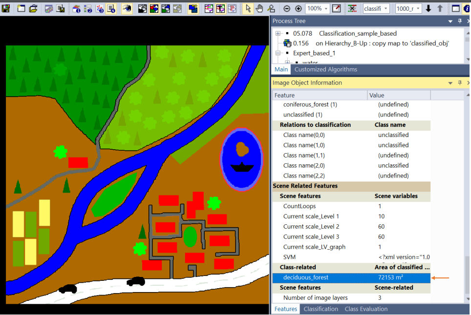
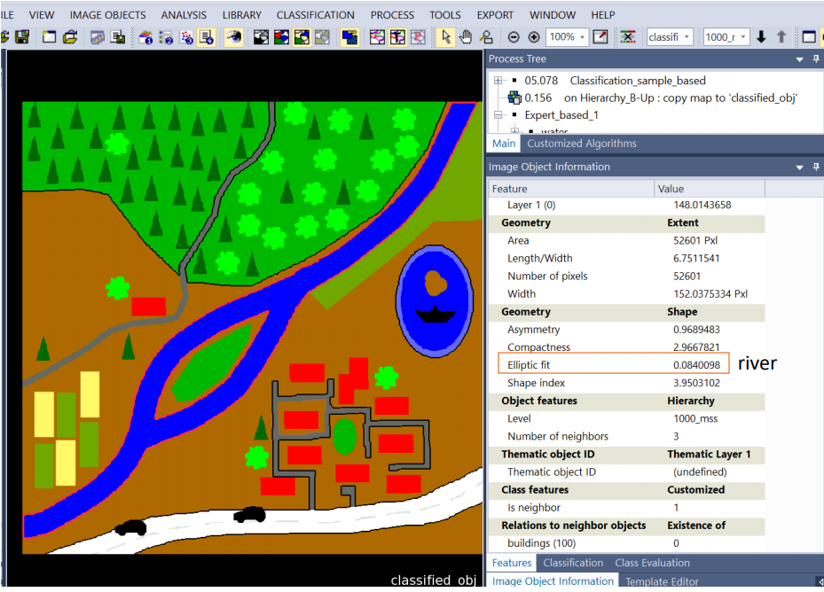
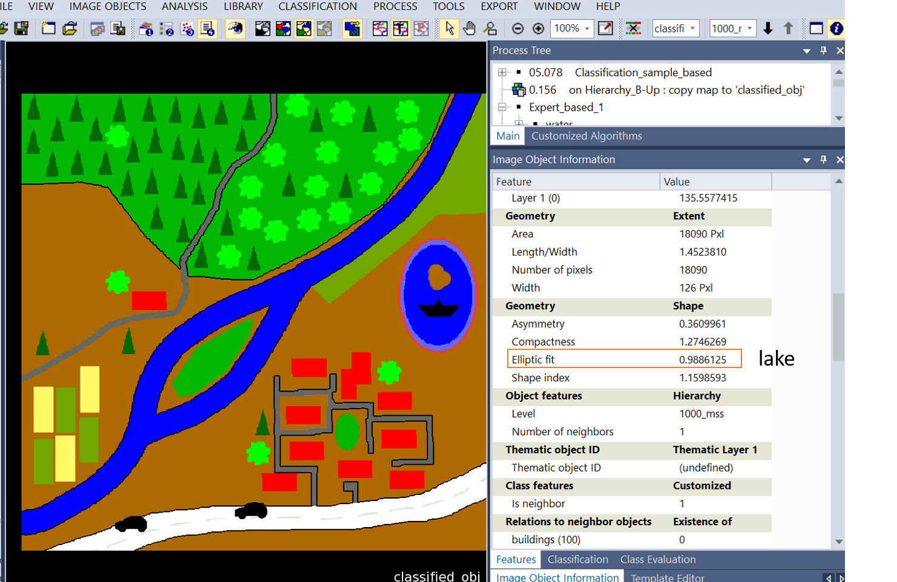

```{r setup, include=FALSE}
knitr::opts_chunk$set(echo = TRUE)
```

```{r htmlTemplate, echo=FALSE}
# Create the external file
img <- htmltools::img(src = "https://user-images.githubusercontent.com/16768318/96349562-be6c7700-10b0-11eb-973d-ce55906dcf7e.jpeg", 
               alt = 'logo', 
               width="10%",
               style = 'position:absolute; top:50px; right:1%; padding:10px;z-index:200;')

htmlhead <- paste0('
<script>
document.write(\'<div class="logos">',img,'</div>\')
</script>
')

readr::write_lines(htmlhead, path = "header.html")

```

# Part I - Object Statistic

[**Link First Classification E-Cognition**](project/Aybar_sample_based.dpr)

[**Link Second Classification E-Cognition**](project/Aybar_expert_based.dpr)

[**TTAMask classes**](project/TTAMask.csv)

[**TTAMask geometry**](project/TTAMask.asc)

# Part II - Object Statistic

**a) Describe shortly (3-5 sentences), why most of the classes of the second classification cannot be addressed in a pixel-based approach, give three specific examples.**

Because most of them depend on heuristic rules based on empirical knowledge. For instance, **Agricultural_grassland**, **river** and **lake** should have a specific shape, classes like **ship** and **island** request to be surrounded by other class, and others like **roads** and **park** matters the distance to a certain class. Pixel-based approaches use only spectral bands (threshold rules) that do not take into consideration spatial features.

<br>

**b)**

  - **Select the appropriate Scene Features in your final project and figure out the area (in map coordinates - not in pixels) for the class: Deciduous_forest**

<center>

</center>

  - **Select the appropriate Object Feature in your final project and figure out the Elliptic fit values (geometry feature) for the classes River and Lake.**


<center>

</center>

<br>

<center>

</center>


**c) Create a customized feature reflecting the following formula for a "greenness" index in your final project:**


  - **What threshold of the 𝐺𝑅𝐸𝐸𝑁𝐸𝑆𝑆 index could be used to differentiate between green vegetation (all the green areas in the image) and the other classes/objects?.**
  
  After try different greenness index threshold we found that the optimal range is  0.20 and 
  0.99.

  - **Can you explain why the "ship" object has an undefined GREENESS value?**
  
Because the ship object (black) has zero value in band 1 and band 2.

```{r echo=FALSE}
suppressMessages(library(mapview))
suppressMessages(library(raster))
rr <- stack("data/img.tif")
suppressWarnings(
  suppressMessages(
    mapview::mapview(rr[[1:3]], legend=FALSE)
  )
)
```

