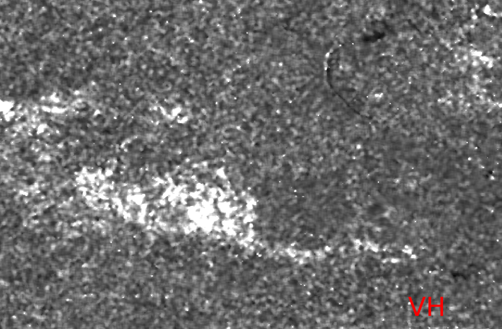

```{r setup, include=FALSE}
knitr::opts_chunk$set(echo = TRUE)
```

```{r htmlTemplate, echo=FALSE}
# Create the external file
img <- htmltools::img(src = "https://user-images.githubusercontent.com/16768318/96349562-be6c7700-10b0-11eb-973d-ce55906dcf7e.jpeg", 
               alt = 'logo', 
               width="10%",
               style = 'position:absolute; top:50px; right:1%; padding:10px;z-index:200;')

htmlhead <- paste0('
<script>
document.write(\'<div class="logos">',img,'</div>\')
</script>
')

readr::write_lines(htmlhead, path = "header.html")

```

# Question N° 01

**Find information about flight direction and polarizations in the
metadata folder**

In metadata folder we can find the following properties:

-   **mds1_tx_rx_polar:** VH. Transmit/Receive polarization for the
    data.
-   **mds2_tx_rx_polar:** VV. Transmit/Receive polarization for the
    data.
-   **PASS:** Direction of the orbit ('ASCENDING' or 'DESCENDING').

<center>


</center>

# Question N° 02

**What is VV and VH stands for?**

Both refer to the orientation of the microwave radiation transmitted by
the radar. **VV** means single **co-polarization**, vertical transmit
and vertical receive and **VH** means dual-band **cross-polarization**,
vertical transmit/horizontal receive (See section 2.3.1 [Veloso et al.
2017](https://paperpile.com/shared/I6sJet)).

<center>

</center>
# Question N° 03

**What is the difference between amplitude band and intensity band for
each polarization?**

In a nutshell, **Intensity** is equals to the square of the Amplitude.
Both parameters given us information about the strength of the reflected
echo (Backscattering). SNAP use intensity values and Look-Up Tables (LUTs) to
generate beta, sigma or gamma naught value. See [ESA Level-1 Radiometric Calibration](https://sentinel.esa.int/web/sentinel/radiometric-calibration-of-level-1-products).

<center>


</center>

The images above show the values of intensity and amplitude for
S1B_IW_GRDH_1SDV_20170702T062605_20170702T062630_006305_00B160_6DA0. As can be seen, the variance of both images is almost the same.

# Question N° 04

**Inspect the intensity VV and the intensity VH band. Zoom in to the
different areas (for example agriculture area, urban areas, river,
etc.). Create a screenshot, and describe the differences between VV and
VH polarization for each of the example areas.**

**VV** and **VH** values are driven by:

-   **The frequency or wavelength:** Radar parameter
-   **Incidence angle:** Radar parameter
-   **Dielectric constant:** Surface parameter
-   **Surface roughness relative to the wavelength:** Surface parameter

**Agriculture:**

<center>


</center>

Overall, it can be said that **VH** values are darker (lower) than
**VV**. **VH** also show us more spatial variance and correspondence to
the crop fields if we compare it with the high-resolution
optical image. In both images, dark values seems to be related to
**rough surface scattering**, while gray and white values with the
**volume scattering** and **double bounce** respectively.

**Urban areas:**

<center>


</center>

Like agriculture images, in urban areas, **VH** values are darker
(lower) than **VV**. In SAR images urban areas almost always represent
the brightest pixels since that the dominant mechanism is the **double
bounce**. However, specific regions like airstrip or other plane/smooth
could present low backscattered intensity.

**Water bodies**

<center>


</center>

Calm water bodies (see image above) are dark in both **VV** and **VH**
images. According to [Solbø and Solheim
2005](https://paperpile.com/app/p/6ff7cc23-745c-0534-b56f-d919a767ffa1),
it is due for two reasons: the high dialectric constant of the water
(\~80) and the smooth of the surface of the water. However in rough
water surfaces like rivers (see urban areas images above) is it possible
to have parts with higher backscatter due to the incoming angle.

# Question N° 05

**Why do we need to apply orbit file correction?**

Orbit state vector (available inside SAR metadata) contains information
about the image localization that generally is not accurate. The
**precise orbits of satellites are determined after several days** and
are available days-to-weeks after the generation of the product (See
[link](https://pyrosar.readthedocs.io/en/latest/general/OSV.html)). The
**orbit file correction** is a SNAP inline step for downloading and
updating the SAR orbit state vector. This step will help to improve the
image geocoding. See [What does
the APPLY orbit file
for？](https://forum.step.esa.int/t/what-does-the-apply-orbit-file-for/8620/3) 
for more information.


# Question N° 06

**There are three products available, sigma0, gamma0, and beta0.
Describe each of them. For which application can we use sigma, gamma, or
beta?**

$sigma_0$, $gamma_0$ and $beta_0$ are the possible outputs after
calibrate a SAR image (Radar \> Radiometric \> Calibrate). The objective
of SAR calibration is to provide images in which the pixel values can be
directly related to the radar backscatter of the scene.


The illustration below show the reference areas for the three radar
backscatter conventions: beta, sigma, and gamma naught.

<center>


</center>

-   $beta_0$ (radar brightness coefficient) are the results after convert DN (16-bit) to radar brightness:

$beta_0 = calFactor * DN^2$

-   $sigma_0$ (backscatering coeficient) are the results after apply illumination correction to radar brightness:

$sigma_0 = beta_0 * sin(i_{x, y})$

where $sin(i_{x, y})$ is the sin of local incidence angle.

-   Finally, $gamma_0$ is the backscatering coeficient normalized. It is calculate
after applied the cosine of the incidence angle to sigma values. 

$gamma_0 = beta_0 * tan(i_{x, y})$

where $tan(i_{x, y})$ is the tan of local incidence angle.

According with [Atwood, et. al
2016](https://paperpile.com/app/p/26b841f6-8b9e-0076-be0d-d3b60e3d8ece),
[Babu, et. al
2016](https://paperpile.com/app/p/1c6b7c35-a7aa-025a-bb98-6a276c90cd40),
and in our *visual interpretation of the images,* there is no significant differences
between $beta_0$, $sigma_0$ and $gamma_0$ results.

# Question N° 07

**Perform comparison between change detection results derived from VV
against VH polarizations. Describe your results.**

Change detection algorithm inside **SNAP**, use a log ratio between the
first and the second image (See this [link](https://forum.step.esa.int/t/change-detection-which-algorithm-is-implemented/4867)). $$DL = log(\frac{I_f}{I_g})$$ Where **If**
represent the values from the first image and **Ig** from the second
one.

<center>


</center>

In general, the brightness (high) and dark (low) values show us the
changes. In the image **VV**, we can identify three specific areas where
the ratio shows us changes. The first region (See image VV) is located
inside a mine (mining tailings), and the second and third are inside a lake (See
high-resolution image). As you can observe, all those areas are related to the presence of water that, usually, present $sigma_0$ naught values near zero. Therefore, it is more probable that these changes are related to the use of a
ratio division into extremely low values (e.g. log (0.001 / 0.0001) = 2.3) rather than real changes itself. With respect to the image **VH**, we can see only one area with high ratio values, and it falls within a dry forest. Therefore, it is very likely that this change detected is related to a alteration in the landscape.

# Question N° 08

**Evaluate your results from the VV and VH polarizations with respect to the Copernicus result. Which polarization showed the burned area?. Describe your findings.**

Both polarizations have some correspondence with the results of the [Copernicus Emergency Management Service - Mapping](https://emergency.copernicus.eu/mapping/list-of-components/EMSR210) (See image below). However, our results indicate that **VH** can highlight the burnt area better than **VV**, at least, with the change detection algorithm (log-ratio operator) implemented in SNAP. Also, we notice that **VH** generates less false negative areas in comparison to **VV** results. 

<center>



</center>
