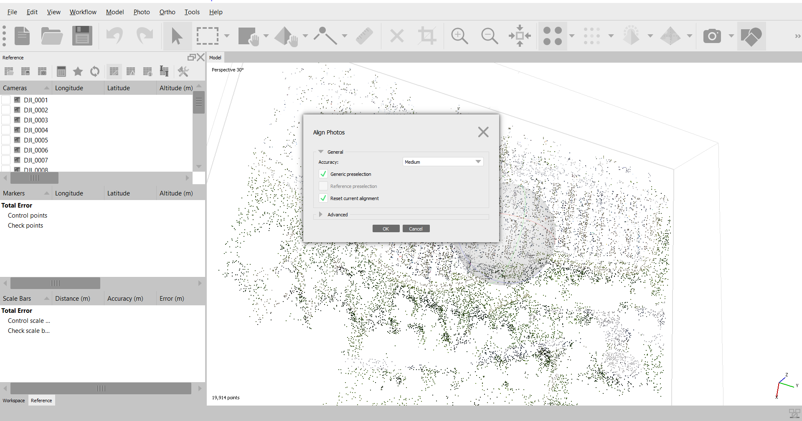
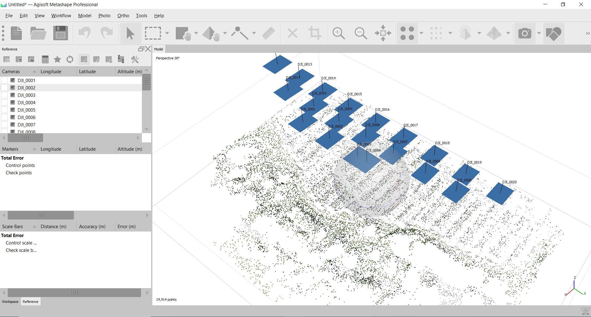
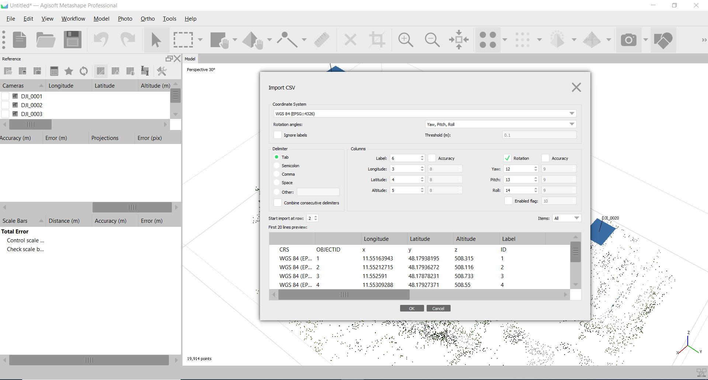
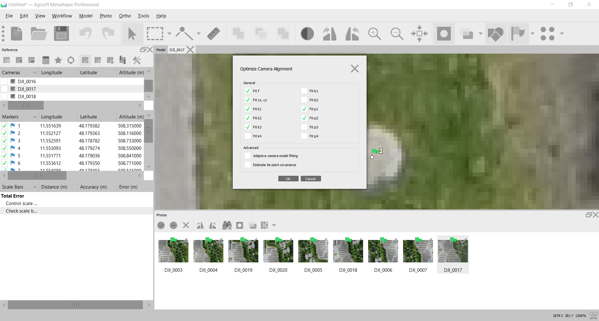
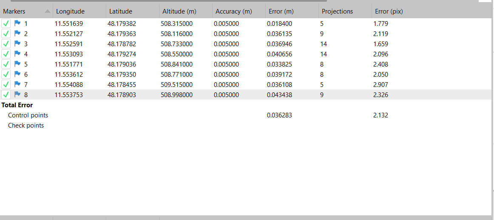
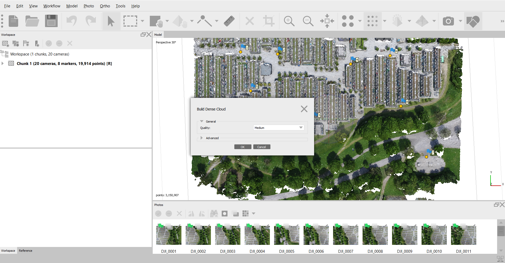
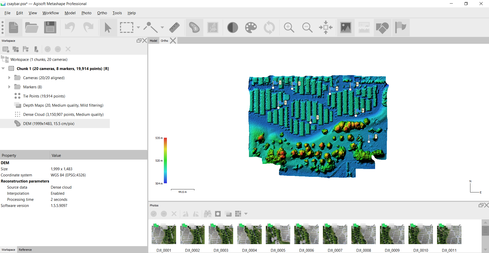
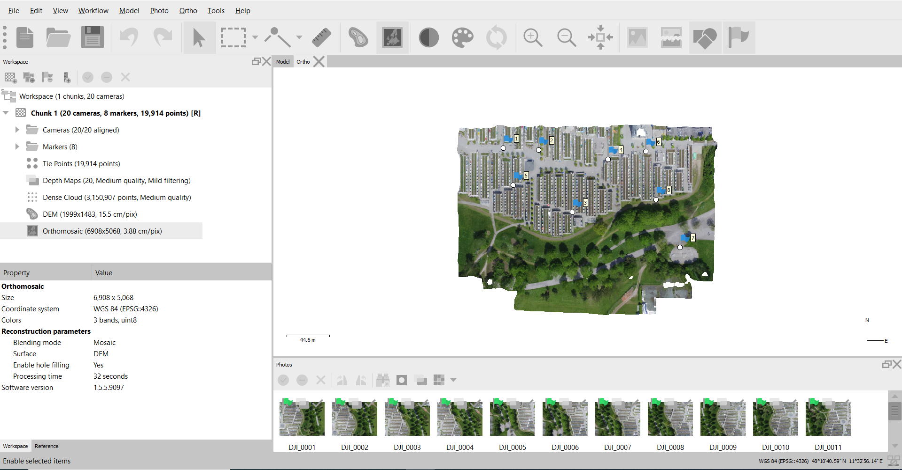
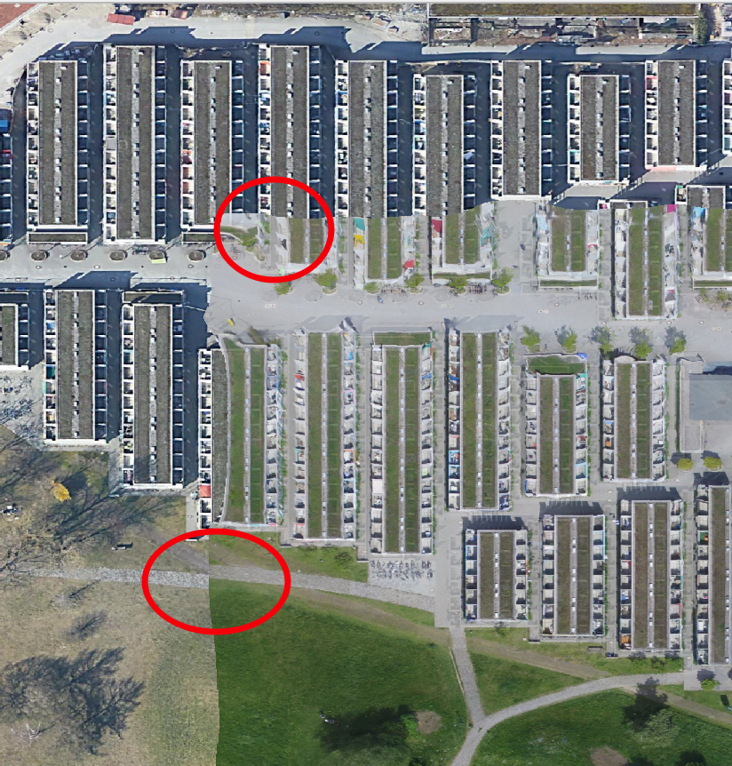

```{r setup, include=FALSE}
knitr::opts_chunk$set(echo = TRUE)
```

```{r htmlTemplate, echo=FALSE}
# Create the external file
img <- htmltools::img(src = "https://user-images.githubusercontent.com/16768318/96349562-be6c7700-10b0-11eb-973d-ce55906dcf7e.jpeg", 
               alt = 'logo', 
               width="10%",
               style = 'position:absolute; top:50px; right:1%; padding:10px;z-index:200;')

htmlhead <- paste0('
<script>
document.write(\'<div class="logos">',img,'</div>\')
</script>
')

readr::write_lines(htmlhead, path = "header.html")

```

# Question N° 01

**Import the aerial images and align them in order to create a sparse point cloud.**

Photos can be added via  **Workflow  > Add photos**. Once added all the photos, the next step is to align them (**Workflow > Align photos**, see figure N°01).



The **align photos** process given as an output a point cloud.



# Question N° 02

**Import the GCPs (.txt-file provided) and distribute them according to the GCP-overview. The detailed views of every GCP will help you to find the correct positions (Note: After the GCPs have been assigned to the respective marks, the sparse point cloud must be updated by clicking on "optimize camera"!).**

Once the images are aligned, it is necessary to import the GCP points by **import reference** and change the global parameters (See image below).



The GCPs are used to estimate and improve the accuracy of the images. The process consists of filter photos with a marker and right-clicking on each marker.



The error after placing all the GCPs is 0.03 m (see image below).



# Question N° 03

**Generate a dense point cloud from your correctly referenced data set**

A dense point cloud is a collection of point positioned which permits us to generate 3D visualization. To generate a dense point cloud in Agisoft you need to go to **Workflow > Build dense cloud**.



# Question N° 04

**Generate both DEM and Orthmosaic and to export them in GeoTIFF format. Visualize the dataset in a GIS environment and draw conclusions about their positional accuracy (e.g. by comparing it with a base map).**

Digital Elevation Model is a raster object which represents elevation data. To create a Digital Elevation Model go to **Workflow > Build DEM**.



An Orthmosaic is a mosaic of orthophotos; go to **Workflow > Build Orthomosaic** to create one. 



If we compare our results with the google satellite basemap we noticed that exists a significant geometric distortion between both images. Probably due to the lack of GCP used in the construction of the google basemap.


