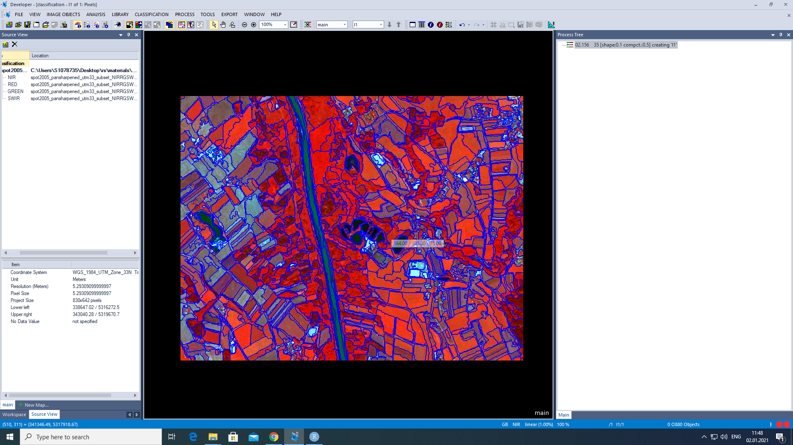
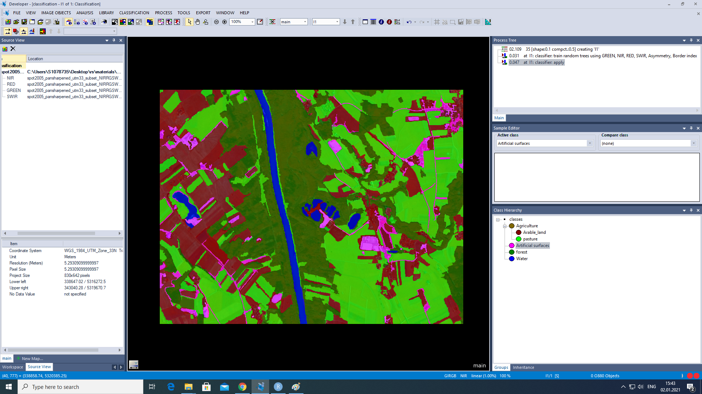
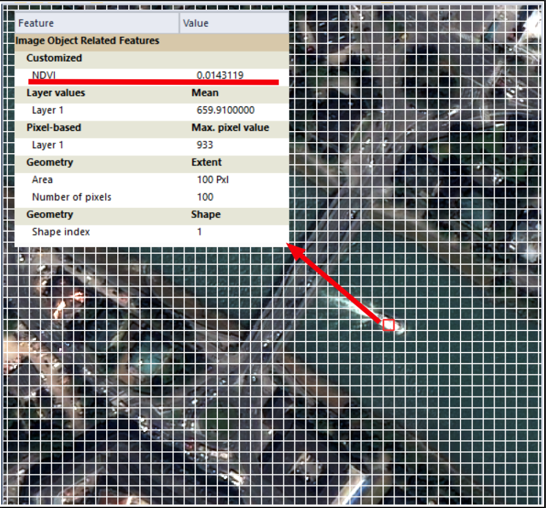
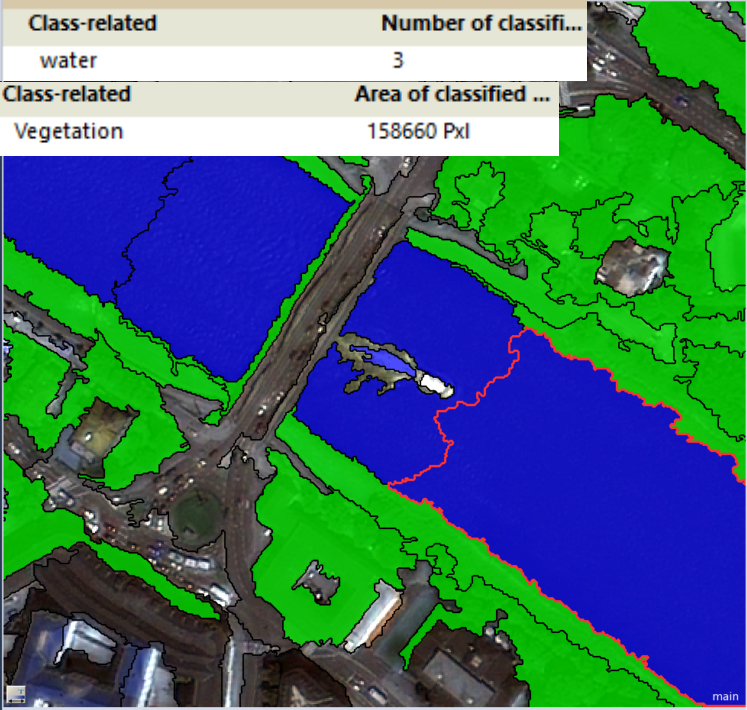

```{r setup, include=FALSE}
knitr::opts_chunk$set(echo = TRUE)
```

```{r htmlTemplate, echo=FALSE}
# Create the external file
img <- htmltools::img(src = "https://user-images.githubusercontent.com/16768318/96349562-be6c7700-10b0-11eb-973d-ce55906dcf7e.jpeg", 
               alt = 'logo', 
               width="10%",
               style = 'position:absolute; top:50px; right:1%; padding:10px;z-index:200;')

htmlhead <- paste0('
<script>
document.write(\'<div class="logos">',img,'</div>\')
</script>
')

readr::write_lines(htmlhead, path = "header.html")

```

# Part I - Classifiers 
**Download my ECognition project [here](https://github.com/csaybar/digitalearth/raw/master/assigments/remotesensing/assigment_03/data/aybar_classification.dpr).**

In this first part we will train a model of [**random trees**](), the steps are as follows:

1) Generation of homogeneous areas in the image (super-pixels).



2) Creation of samples for each target class.


3) Train the classifier (training).
4) Apply the classifier in every super-pixels of the image (prediction).




# Part II - Object features for classification

## Question 1
**What becomes obvious if you compare the values for the two objects of the chessboard segmentation?**

Chessboard segmentation is the simplest way to create super-pixels in an image. For answer this question, the image was firstly segmented into blocks (see image below) of size 10x10 and the following features were added: **NDVI**, **blue band**, **max blue band value in the block**, **area**, and the **shape index**.

<figure>
<center>
  <br>
  <caption>
    <strong>
      Figure 01: Result of chessboard segmentation. Object 01
    </strong>
  </caption>
</center>
</figure>

When comparing two different objects, one corresponding to a boat and the other to a river, we note that for this specific example, all features present a similar value except those related to the spectral values (i.e. NDVI and blue band values).

<figure>
<center>
  <br>
  <caption>
    <strong>
      Figure 02: Result of chessboard segmentation: Object 02
    </strong>
  </caption>
</center>
</figure>

## Question 2
**Which features don't make that much sense in this case?**

All those features related to the geometry of the objects (e.g. area, perimeter, etc.) since the chessboard segmentation creates homogeneous objects. For instance, for all the objects in the image the area always will be 100 pixels units due to that the block is of 10x10 pixels.

## Question 3
**How many objects were classified as "water"?**

For the question 3 and 4 we carry out a multiresolution segmentation. As figure 4 and figure 5
shows, the geometry features (e.g. area) has more relevance in comparison to chessboard 
segmentation. 

<figure>
<center>
  <br>
  <caption>
    <strong>
      Figure 03: Result of multiresolution segmentation: Object 01
    </strong>
  </caption>
</center>
</figure>

Using a simple threshold we classify the objects in the image in:

- vegetation: NDVI >= 0.25
  - high_air_quality
  - low_air_quality
- water: NDVI <= -0.15
- boat: Using **relative border to**, if the object is completely surrounded by water.

<figure>
<center>
  <br>
  <caption>
    <strong>
      Figure 04: Result of multiresolution segmentation: Object 02
    </strong>
  </caption>
</center>
</figure>

After the threshold-based classification, we obtain 3 objects of class water.

## Question 4

**What is the area of the whole vegetation class (if you select the vegetation class to generate the feature, it will summarize the values from the grouped sub-classes)?**

We obtain a vegetation area of 158660 pixel units or 0.0571176 km2.

<figure>
<center>
  <br>
  <caption>
    <strong>
      Figure 05: Summarize after the threshold based classification.
    </strong>
  </caption>
</center>
</figure>

## Question 5

**What is the meaning of the distance value when you create the feature?**

For this question a second object level is created with a scale of 50, shape 0.5,
and compact 0.5. 

<figure>
<center>
  <br>
  <caption>
    <strong>
      Figure 05: Second level of segmentation.
    </strong>
  </caption>
</center>
</figure>

In this case, the vegetation super-class contains the classes, high_air_quality and low_air_quality. We can create a new feature based on the relations between super and sub-classes. The **distance** argument represents the hierarchical distance to the super-object.
