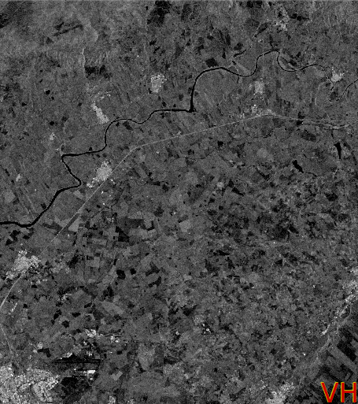
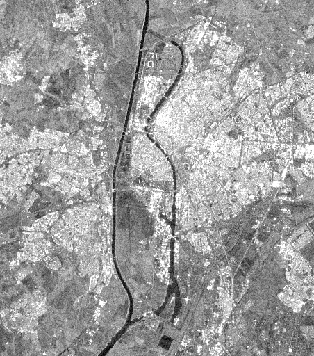
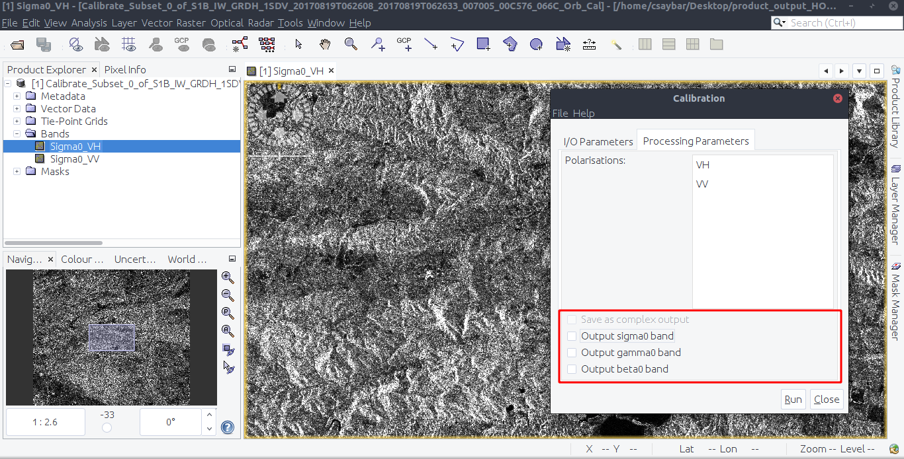
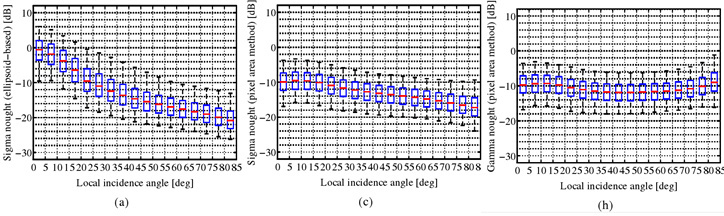

```{r setup, include=FALSE}
knitr::opts_chunk$set(echo = TRUE)
```

```{r htmlTemplate, echo=FALSE}
# Create the external file
img <- htmltools::img(src = "https://user-images.githubusercontent.com/16768318/96349562-be6c7700-10b0-11eb-973d-ce55906dcf7e.jpeg", 
               alt = 'logo', 
               width="10%",
               style = 'position:absolute; top:50px; right:1%; padding:10px;z-index:200;')

htmlhead <- paste0('
<script>
document.write(\'<div class="logos">',img,'</div>\')
</script>
')

readr::write_lines(htmlhead, path = "header.html")

```

# Question N° 01

**Find information about flight direction and polarizations in the metadata folder**d

In metadata folder we can find the following properties:

-   **mds1\_tx\_rx\_polar:** VH. Transmit/Receive polarization for the data.
-   **mds2\_tx\_rx\_polar:** VV. Transmit/Receive polarization for the data.
-   **PASS:** Direction of the orbit ('ASCENDING' or 'DESCENDING').

<center>


</center>

# Question N° 02

**What is VV and VH stands for?**

Both refer to the orientation of the microwave radiation transmitted by the radar. **VV** means single **co-polarization**, vertical transmit and vertical receive and **VH** means dual-band **cross-polarization**, vertical transmit/horizontal receive (See section 2.3.1 [Veloso et al. 2017](https://paperpile.com/shared/I6sJet)).

# Question N° 03

**What is the difference between amplitude band and intensity band for each polarization?**

In a nutshell, **Intensity** is equals to the square of the Amplitude. Both parameters given us information about the strength of the reflected echo.

# Question N° 04

**Inspect the intensity VV and the intensity VH band. Zoom in to the different areas (for example agriculture area, urban areas, river, etc.). Create a screenshot, and describe the differences between VV and VH polarization for each of the example areas.**

**VV** and **VH** (radar backscatter) contains information about the Earth's surface, their intensity are driven by:

-   **The frequency or wavelength:** Radar parameter
-   **Incidence angle:** Radar parameter
-   **Dielectric constant:** Surface parameter
-   **Surface roughness relative to the wavelength:** Surface parameter

The SAR images were taken with a different of **45 days**. Therefore, could exist high different of soil moisture between both images.

**Agriculture:**

<center>

  

</center>

Overall, it can be said that **VH** is darker than **VV**. It also manifests more spatial variance and correspondence to the tilled agricultural fields if we compare with the high-resolution optical image. In both images, dark values seems to be related to **rough surface scattering**, while gray and white values with the **volume scattering** and **double bounce** respectively.

**Urban areas:**

<center>

  

  

</center>

Like the zoom in agriculture areas, in urban areas **VH** are darker than **VV** values. In SAR images urban areas almost always present the brightest pixels since that the dominant mechanism is the **double bounce**. However, specific regions like airstrip or other plane/smooth could present low backscattered intensity.

**Water bodies**

<center>

  

</center>

Water bodies are dark in both **VV** and **VH** imagesfor two reasons: the high dialectric constant of the water (\~80) and the smooth of the surface of the water.

# Question N° 05

**Why do we need to apply orbit file correction?**

This is a SNAP inline step for creating a file with accurate satellite position information that will help to improve the geocoding and other SAR processing results. The file created contains accurate satellite position and velocity information. See [What does the APPLY orbit file for？](https://forum.step.esa.int/t/what-does-the-apply-orbit-file-for/8620/3).


# Question N° 06

**There are three products available, sigma0, gamma0, and beta0. Describe each of them. For which application can we use sigma, gamma, or beta?**

$sigma_0$, $gamma_0$ and $beta_0$ are the possible outputs after application a calibration (Radar \> Radiometric \> Calibrate).



The illustration below show the reference areas for the three radar backscatter conventions: beta, sigma, and gamma naught.

<center>

</center>

-   $beta_0$ are the results after convert DN (16-bit) to radar brightness:

$beta_0 = calFactor * DN^2$

-   $sigma_0$ are the results after apply illumination correction to radar brightness:

$sigma_0 = beta_0 * sin(i_{x, y})$

where $sin(i_{x, y})$ is the sin of local incidence angle.

-   Finally, $gamma_0$ are the results after apply illumination correction suitable for volume scatters.

$gamma_0 = beta_0 * tan(i_{x, y})$

where $tan(i_{x, y})$ is the tan of local incidence angle.

According with [Atwood, et. al 2016](https://paperpile.com/app/p/26b841f6-8b9e-0076-be0d-d3b60e3d8ece), [Babu, et. al 2016](https://paperpile.com/app/p/1c6b7c35-a7aa-025a-bb98-6a276c90cd40), and in our *visual interpretation,* there is no significant differences between $sigma_0$ and $gamma_0$ results. The ideal radiometric correction, should remove completely the influence of local incidence angle (see image below).



# Question N° 07

**Perform comparison between change detection results derived from VV against VH polarizations. Describe your results.**

# Question N° 08

**Evaluate your results from the VV and VH polarizations with respect to the Copernicus result. Which polarization showed the burned area?. Describe your findings.**
