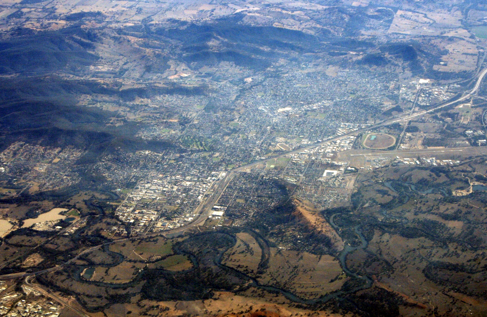

```{r setup, include=FALSE}
library(googleCloudStorageR)
library(reticulate)
library(leaflet)
library(leafem)
library(raster)
library(stars)
library(sf)
source("functions.R")
```




**panorama of the city of Deniliquin**


The city of Deniliquin, Austria (see image below) has been receiving more than twice of tourists each year due to new tourist attractions. For this reason, the city decision makers have planned the extension/modernization of the airport located to the outskirts of the city.

The modernization of the airport involves the construction of a series of buildings that could cause a serious visual impact to the neighborhoods near to the airport. The main building to be constructed is the **air traffic control tower** that needs to have an adequate view of the surrounding area of the airport. Therefore, a height between **10-30 meters** has been planned. 
<br>

```{r echo=FALSE}
mapview::mapviewOptions(fgb = FALSE)
suppressWarnings(
  suppressMessages(
    map_01()
  )
)
```

In the next map we estimate the visual impact of the planned tower considering multiple altitudes, a value of 5 represents that the pixel is visible for the planned tower to a height of 30, 25, 20, 15, and 10 meters. The [viewshed](https://grass.osgeo.org/grass78/manuals/r.viewshed.html) of the airport traffic control tower was computed considering a elevation raster map of 5 meters (See the raster description at the end of this document). Due to computational limitations, the raster is displayed at a low spatial resolution. 

```{r echo=FALSE}
mapview::mapviewOptions(fgb = FALSE)
suppressWarnings(
  suppressMessages(
    map_02()
  )
)
```

**Mouse over the pixels to obtain visual impact values.** For a high-resolution image of the map above see [here](https://user-images.githubusercontent.com/16768318/103380504-5f33d580-4ae9-11eb-8338-c0c6cdbb0e91.png)

The next line chart shows the **viewshed area** on different tower altitude. It can be observed that, **the more the height of the tower the more the visual impact**, doubling the visual area when going from a height of 10 to one of 30 meters.

```{r echo=FALSE}
mapview::mapviewOptions(fgb = FALSE)
suppressWarnings(
  suppressMessages(
    map_03()
  )
)
```

**Mouse over the points to obtain the values.**. 

# Report to the community council

The plans to modernize the Deniliquin airport will carried out a serie of environmental and 
visual impacts. This report focus in the last one, trying to assess the most efficient altitude
for the **air traffic control tower** which is the main infrastructure to be built.


The simple viewshed analyses show that the nearly the entire town of Zell am See will have a clear view of the wind turbine. A wind turbine with a height of 200 m will only slightly increase the affected areas.

When it comes to the total number of affected buildings the number increases by 366. However, this is only because the viewshed of the wind turbine now extends much further to other towns like Kaprun. Here is where most of the new buildings are located to see the wind turbine, when the height of the wind turbine is increased.

But as the fuzzy viewshed analyses shows, the visual impact of a object decreases with increasing distance to the object. Therefore, the affected areas in cities other than Zell am See are of lesser importance, because the impact is smaller.

As a result, this report recommends building the 200-meter wind turbine. The additional height of the turbine is seen by more buildings and affects more areas. However, the increase in power generation can be rated higher than the visual impact on buildings that only see the wind turbine from a great distance as a small object.

