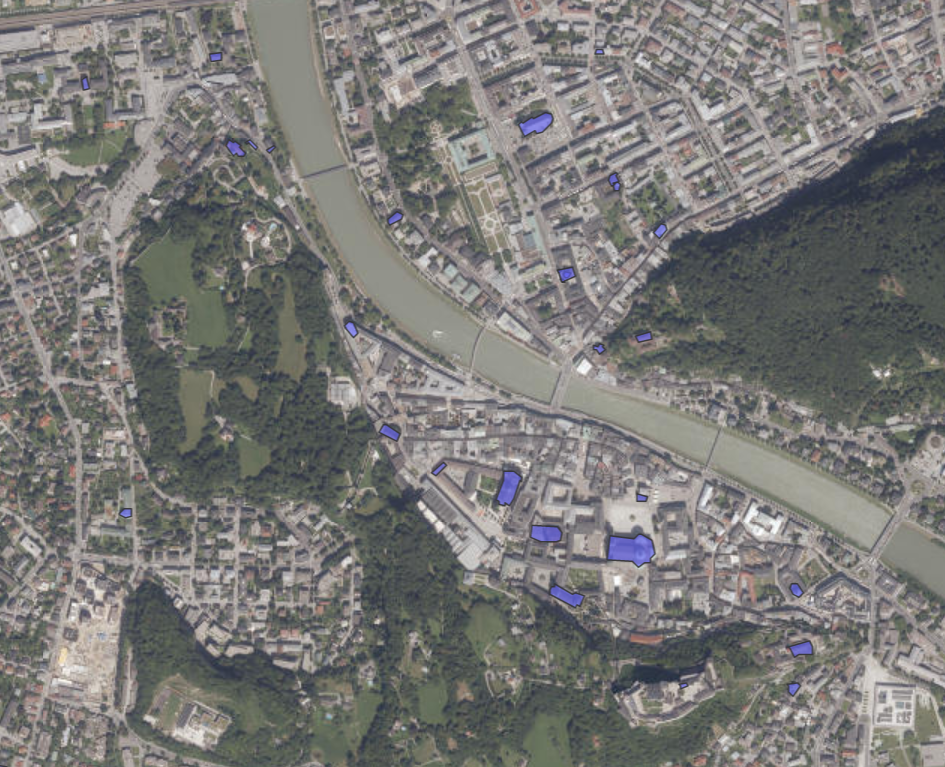

```{r setup, include=FALSE}
knitr::opts_chunk$set(echo = TRUE)
```

```{r htmlTemplate, echo=FALSE, warning=FALSE}
# Create the external file
img <- htmltools::img(src = "https://user-images.githubusercontent.com/16768318/96349562-be6c7700-10b0-11eb-973d-ce55906dcf7e.jpeg", 
               alt = 'logo', 
               width="10%",
               style = 'position:absolute; top:50px; right:1%; padding:10px;z-index:200;')

htmlhead <- paste0('
<script>
document.write(\'<div class="logos">',img,'</div>\')
</script>
')

readr::write_lines(htmlhead, path = "header.html")
```

# Possible context

<b>
You work as a freelancer as an expert in Exploratory Spatial Data Analysis (ESDA)  and mainly work with descriptive statistics. The results that you create for your 
clients often consists of maps, infographics, or reports. 
Your recent client is Dr. Esther A. House from the public relations department 
of the city management. She is interested in some characteristics of the buildings, 
such as where specific buildings are located, what their size is, and the density of 
buildings around the fortress. To conduct your analyses, she grants access to their 
PostgreSQL spatial database system to you. Therefore, you are able to directly 
connect using QGIS.
</b>

## Create and run a container with POSTGIS

1. Create a Dockerfile (expose the port, see below), and run: 

**`docker build . --tag csaybar/postgis`**

```{r eval=FALSE}
FROM postgis/postgis
# Expose default postgres port
EXPOSE 5432
```

2. Create a file `docker-compose.yaml` (with the text below) and execute in console: 

**`docker-compose up -d`**

```{r eval=FALSE}
version: '0.1'
services:
  database:
    image: csaybar/postgis:v0.1 # Latest official PostGIS version
    env_file:
      - database.env # Configure postgres
    volumes:
      - database-data:/var/lib/postgresql/data/ # persist data even if container shuts down
    ports:
      - "5432:5432"
volumes:
  database-data: 
```

All the files are available [here](https://github.com/csaybar/digitalearth/tree/master/assigments/spatial_dataset)

## Load all necessary R libraries

```{r warning=FALSE,message=FALSE}
library("RPostgreSQL")
library("sf")
source("../postgis/utils.R") # Utils to use POSTGIS with R!
```

## Create a connection to the Postgres database

```{r}
drv <- dbDriver("PostgreSQL") # load the PostgreSQL driver
con <- RPostgreSQL::dbConnect(
  drv = drv, 
  dbname = "spdb_course",
  host = "localhost", 
  user = "csaybar", 
  password = "csaybar",
  port = 5432
)
```


## Upload Salzburg shapefiles to the dataset

```{r eval=FALSE}
files_in <- list.files("data/","\\.shp$",full.names = TRUE)
tables_names <- c("salzburg_buildings", "salzburg_districts", "salzburg_roads")
for (index in seq_along(tables_names)) {
  st_write(read_sf(files_in[index]), dsn = con, layer = tables_names[index]
           , append = FALSE)
}
```


# Question #1

**Repeat the query with all buildings, which are of type church and then repeat the query to create a layer, which contains churches and schools.**

**Only churches**

```{r}
query_01_01 <- "SELECT * FROM salzburg_buildings WHERE type='church';"
slzg_church <- st_read(con, query = query_01_01)
slzg_church
```


<center>

</center>

**Churches and schools**

```{r}
query_01_02 <- "SELECT * FROM salzburg_buildings WHERE type='church' OR type='school';"
slzg_cs <- st_read(con, query = query_01_02)
slzg_cs
```

<center>

</center>

# Question #2

**Extend the query and add a column that contains the calculated area of the houses.**


```{r}
query_02_01 <- "SELECT b.*, ST_Area(b.geometry) as area" %|%
  " FROM salzburg_buildings AS b WHERE type='school';"
slzg_area_school <- st_read(con, query = query_02_01)
slzg_area_school
```

# Question #3

**Extend the query as follows to calculate the distance:**

```{r}
query_02_02 <- "SELECT b.*, ST_Distance(b.geometry, g.geometry) as distance" %|%
  " FROM salzburg_buildings as b," %|%
  " (SELECT geometry FROM salzburg_buildings WHERE name = 'Glockenturm') as g;"
slzg_distance <- st_read(con, query = query_02_02)
slzg_distance
```

We will save the **slzg_distance** file in the /temp folder:

```{r eval=FALSE}
slzg_filename <- sprintf("%s.shp", tempfile())
write_sf(slzg_distance, slzg_filename)
```

<center>

</center>

# Question #4

**Execute the following, modified query to select all buildings, which are within 500m to the fortress and visualise the result in QGIS.**

```{r}
query_02_03 <- "SELECT b.*" %|%
  "FROM salzburg_buildings AS b," %|%
  "(SELECT geometry FROM salzburg_buildings WHERE name = 'Glockenturm') AS g" %|%
  "WHERE ST_Distance(b.geometry, g.geometry) < 500;"
slzg_df <- st_read(con, query = query_02_03)
slzg_df
```

<center>

</center>

# Question #5

<b>
Unfortunately, an elephant walked through my screen when I did the screenshot
of the last example to show how many buildings are within 1km distance. How
many buildings are there with this condition? 
</b>


```{r warning=FALSE}
query_02_03 <- "SELECT COUNT(b.*)" %|%
  "FROM salzburg_buildings AS b," %|%
  "(SELECT geometry FROM salzburg_buildings WHERE name = 'Glockenturm') AS g" %|%
  "WHERE ST_Distance(b.geometry, g.geometry) < 500;"
slzg_df <- st_read(con, query = query_02_03)
slzg_df$count
```


# Question #6

<b>
Of course it is also possible to combine spatial operations and filters. What is
the average size of all buildings, which are within 1km distance to the fortress
(including the fortress itself)? Make a screenshot, which shows the query and
the result. and explain in your own words how the query works.
</b>

```{r warning=FALSE}
query_03_01 <- "SELECT AVG(ST_Area(b.geometry))" %|%
  "FROM salzburg_buildings AS b," %|%
  "(SELECT geometry FROM salzburg_buildings WHERE name = 'Glockenturm') AS g" %|%
  "WHERE ST_Distance(b.geometry, g.geometry) < 1000;"
slzg_df_avg <- st_read(con, query = query_03_01)
slzg_df_avg$avg
```

