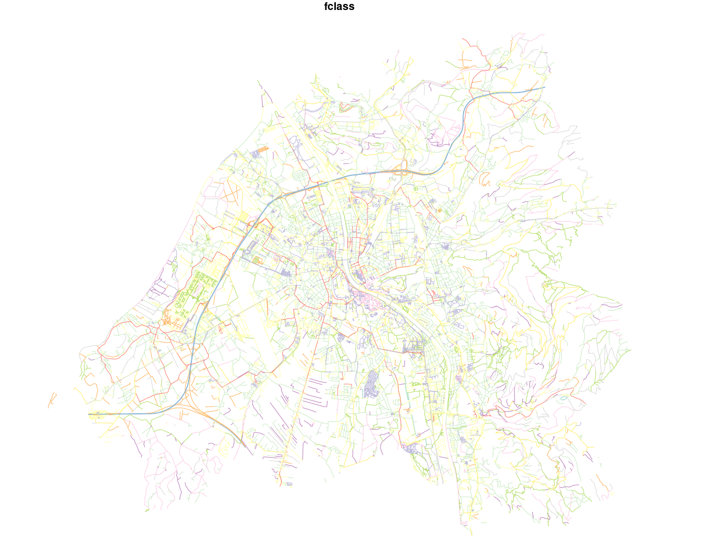
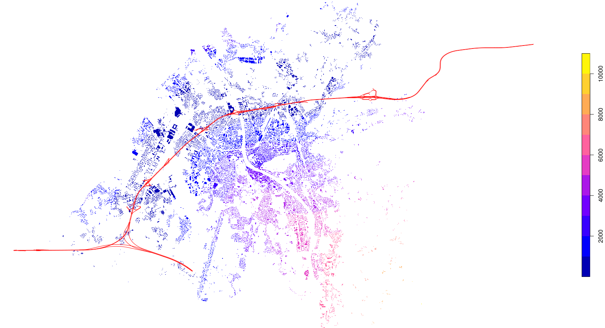
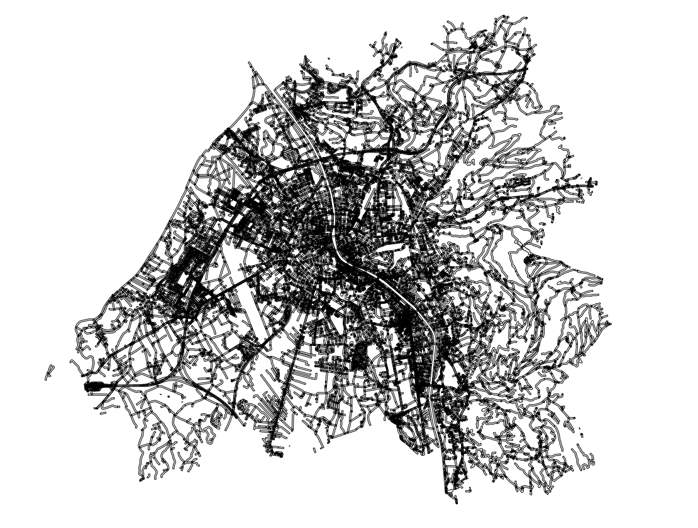
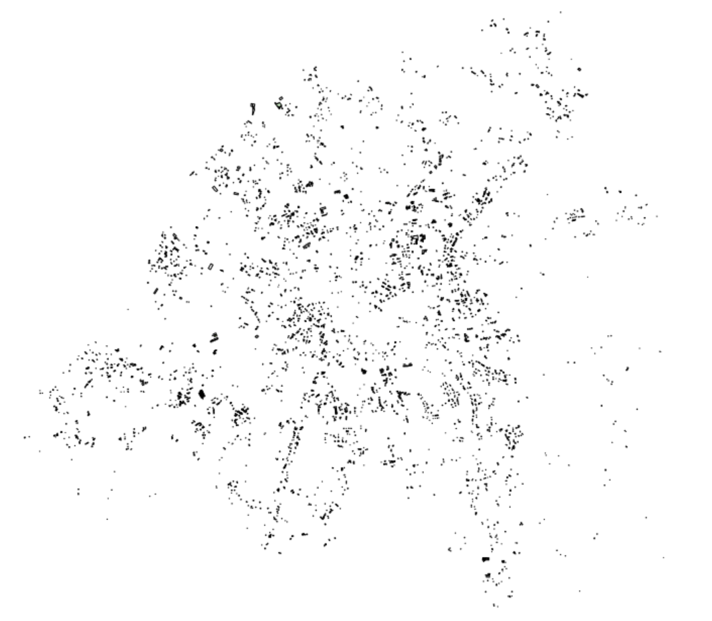

```{r setup, include=FALSE}
knitr::opts_chunk$set(echo = TRUE)
```

```{r htmlTemplate, echo=FALSE, warning=FALSE}
# Create the external file
img <- htmltools::img(src = "https://user-images.githubusercontent.com/16768318/96349562-be6c7700-10b0-11eb-973d-ce55906dcf7e.jpeg", 
               alt = 'logo', 
               width="10%",
               style = 'position:absolute; top:50px; right:1%; padding:10px;z-index:200;')

htmlhead <- paste0('
<script>
document.write(\'<div class="logos">',img,'</div>\')
</script>
')

readr::write_lines(htmlhead, path = "header.html")
```

# Possible context

<b> <strong>
The federal environmental agency employs you as database and GIS expert to
conduct some analyses on the human-environment nexus and how they influences
each other. Being in a government agency, you are on your own to conduct the
queries - except one colleague of yours, who wants to conduct everything in his
old-school GIS button-based approach. While he – called Klik Bill – is in the coffee
break, you have some time to conduct the required analyses using PostGIS. But as
soon as he comes back, the discussion begins ...
</b> </strong>

## Create and run a container with POSTGIS

1. Create a Dockerfile (expose the port, see below), and run: 

**`docker build . --tag csaybar/postgis`**

```{r eval=FALSE}
FROM postgis/postgis
# Expose default postgres port
EXPOSE 5432
```

2. Create a file `docker-compose.yaml` (with the text below) and execute in console: 

**`docker-compose up -d`**

```{r eval=FALSE}
version: '0.1'
services:
  database:
    image: csaybar/postgis:v0.1 # Latest official PostGIS version
    env_file:
      - database.env # Configure postgres
    volumes:
      - database-data:/var/lib/postgresql/data/ # persist data even if container shuts down
    ports:
      - "5432:5432"
volumes:
  database-data: 
```

All the files are available [here](https://github.com/csaybar/digitalearth/tree/master/assigments/spatial_dataset)

## Load all necessary R libraries

```{r warning=FALSE,message=FALSE}
library("RPostgreSQL")
library("sf")
source("../postgis/utils.R") # Utils to use POSTGIS with R!
```

## Create a connection to the Postgres database

```{r}
drv <- dbDriver("PostgreSQL") # load the PostgreSQL driver
con <- RPostgreSQL::dbConnect(
  drv = drv, 
  dbname = "spdb_course",
  host = "localhost", 
  user = "csaybar", 
  password = "csaybar",
  port = 5432
)
```


## Upload Salzburg shapefiles to the dataset

```{r eval=FALSE}
files_in <- list.files("data/","\\.shp$",full.names = TRUE)
tables_names <- c("salzburg_buildings", "salzburg_districts", "salzburg_roads")
for (index in seq_along(tables_names)) {
  st_write(read_sf(files_in[index]), dsn = con, layer = tables_names[index]
           , append = FALSE)
}
```


# Question #1

**Categorise the length of the roads.**

```{r eval=FALSE}
query_01 <-
"SELECT r.*," %|%
  "CASE" %|% 
  "  WHEN ST_Length(geometry) <= 15 THEN 'very small'" %|%
  "  WHEN ST_Length(geometry) > 15 AND ST_Length(geometry) <= 40 THEN 'small'" %|% 
  "  WHEN ST_Length(geometry) > 40 AND ST_Length(geometry) <= 80 THEN 'medium'" %|% 
  "  WHEN ST_Length(geometry) > 80 AND ST_Length(geometry) <= 150 THEN 'large'" %|% 
  "  WHEN ST_Length(geometry) > 150 THEN 'very large'" %|% 
  "END AS road_category" %|%
"FROM" %|%
  " salzburg_roads AS r;"
query_01_sf <- st_read(con, query = query_01)
```

<center>

</center>

# Question #2

**Create and execute the query: What is the minimal distance to the motorways**

```{r eval=FALSE}
query_02 <- "SELECT b.*, ST_Distance(m.geometry, b.geometry) as distance" %|%
  " FROM salzburg_buildings as b," %|%
  "  (SELECT ST_Union(geometry) as geometry" %|%
  "   FROM salzburg_roads" %|%
  "   WHERE fclass = 'motorway' OR fclass = 'motorway_link') as m;"
query_02_sf <- st_read(con, query = query_02)
```

<center>

</center>


# Question #3

**Create and execute a query to calculate the buffer potential_noise.**

```{r eval=FALSE}
query_03 <-
"SELECT" %|% 
"  r.*," %|% 
"  ST_Buffer(r.geometry, 20, 'endcap=flat') AS potential_noise" %|% 
"FROM" %|% 
"  salzburg_roads AS r;"
query_03_sf <- st_read(con, query = query_03)
```

<center>

</center>


# Question #4

**Store the previous query in a new table.**

Create a new table 

```{r, eval=FALSE}
query_04 <- 
  "SELECT" %|% 
  "  ST_Buffer(ST_Union(r.geometry), 20, 'endcap=flat') AS buffer" %|% 
  "INTO  potential_noise" %|%
  "FROM " %|%
  "  salzburg_roads AS r;"
query_04_sf <- st_read(con, query = query_04)
```

Use the new table `potential_noise` to realize a new query.

```{r eval=TRUE}
query_05 <- 
  "SELECT b.*" %|% 
  "FROM" %|% 
  " salzburg_buildings AS b," %|% 
  " potential_noise AS n" %|%
  "WHERE " %|%
  "  ST_Intersects(n.buffer, b.geometry) IS FALSE;"
query_05_sf <- st_read(con, query = query_05)
```

<center>

</center>


# Question #5

**Unfortunately your colleague Klik Bill likes graphical user interfaces much more than writing SQL and as he comes back from the coffee break he starts a discussion with you, arguing that graphical user interfaces are superior. Think of three situations, in which having GIS operations written as SQL queries can be beneficial and has advantages (This task is not a call to consider SQL queries always as better!).**

- SQL (PostGIS) is faster in comparison to traditional GIS pipelines (shapefile+geoprocessing). 

<center>

</center>

- Once generated a SQL expression you can run it as many times as you want without any extra effort. No matter that it is a complex geoprocess that requires many steps.

- It is easier to maintain a geoprocessing written as SQL rather than others that use GUI.