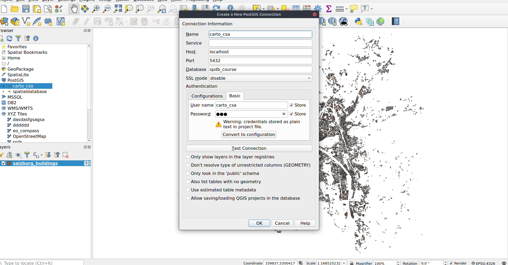
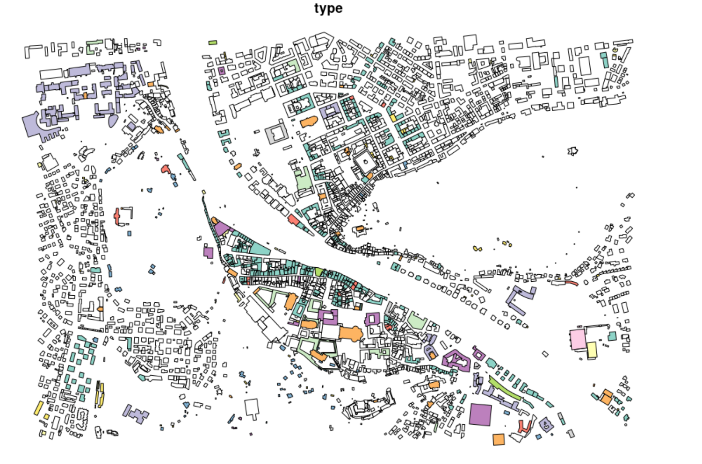
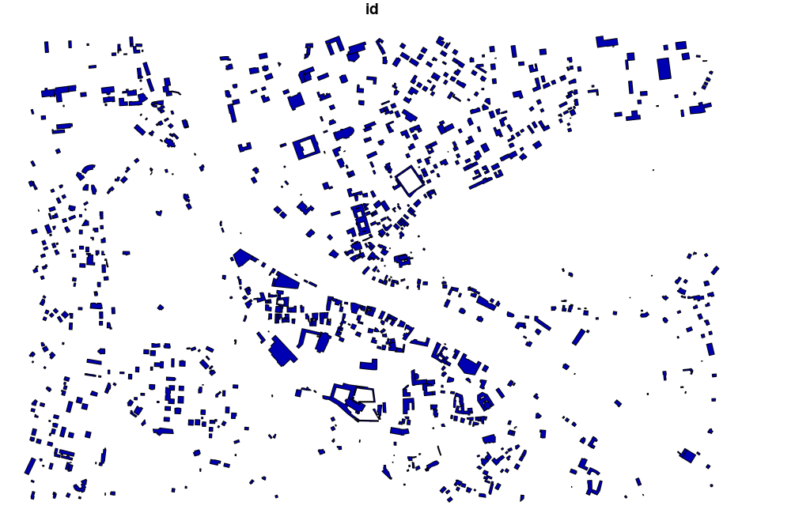

```{r setup, include=FALSE}
knitr::opts_chunk$set(echo = TRUE)
```

```{r htmlTemplate, echo=FALSE, warning=FALSE}
# Create the external file
img <- htmltools::img(src = "https://user-images.githubusercontent.com/16768318/96349562-be6c7700-10b0-11eb-973d-ce55906dcf7e.jpeg", 
               alt = 'logo', 
               width="10%",
               style = 'position:absolute; top:50px; right:1%; padding:10px;z-index:200;')

htmlhead <- paste0('
<script>
document.write(\'<div class="logos">',img,'</div>\')
</script>
')

readr::write_lines(htmlhead, path = "header.html")
```

# Possible context

<b> <strong>
You work as team leader in the municipality of SimCity. Your team manages data
about streets and buildings of SimCity. The core of your operations is a database
system to which most of your colleagues have access for the purpose of inserting
and updating data. Another requirement is to generate frequent reports of buildings
including additional information in form of maps. Until now, the data was exported
as shapefile and imported into a GIS in which the maps were created. However, it
turned out that this method is error-prone and the maps were often outdated and
did not contain the most recent data.
In order to optimise the procedures, you decide to introduce some changes to the
workflow. For this task, your boss even allows you to employ a new cartographer.
To save money and time, you decide that she should be able to use the most recent
data in your database by accessing them directly from her GIS. However, for her
task it is not necessary that she has write-access to the data and you think that it is
better if her account has has read-only access.
Furthermore, you received an application from a motivated intern, who will visit
your team for the duration of two months. Your decision is to let him work in your
team during this time. However, you have a small conflict now: On the one hand,
you have to protect the data as it contains sensitive information. On the other hand,
you want to be a good boss and provide insights into your workflows and be are as
realistic as possible. You decide that the intern has read-only access to a part of the
data – with several additional limitations. One limitation is spatial: Only data from
one city district should be visible. Further, in the table are columns with sensitive
information, which are not allowed to be publicly accessible and you have to shield
them. In addition, some entries (rows) in the table are protected and should not be
accessible to the intern.
As database expert in your team it is your task to develop a security concept and
configure the database system accordingly to meet the new requirements.</b> </strong>

## Create and run a container with POSTGIS

1. Create a Dockerfile (expose the port, see below), and run: 

**`docker build . --tag csaybar/postgis`**

```{r eval=FALSE}
FROM postgis/postgis
# Expose default postgres port
EXPOSE 5432
```

2. Create a file `docker-compose.yaml` (with the text below) and execute in console: 

**`docker-compose up -d`**

```{r eval=FALSE}
version: '0.1'
services:
  database:
    image: csaybar/postgis:v0.1 # Latest official PostGIS version
    env_file:
      - database.env # Configure postgres
    volumes:
      - database-data:/var/lib/postgresql/data/ # persist data even if container shuts down
    ports:
      - "5432:5432"
volumes:
  database-data: 
```

All the files are available [here](https://github.com/csaybar/digitalearth/tree/master/assigments/spatial_dataset)

## Load all necessary R libraries

```{r warning=FALSE,message=FALSE}
library("RPostgreSQL")
library("sf")
source("../postgis/utils.R") # Utils to use POSTGIS with R!
```

## Create a connection to the Postgres database

```{r}
drv <- dbDriver("PostgreSQL") # load the PostgreSQL driver
con <- RPostgreSQL::dbConnect(
  drv = drv, 
  dbname = "spdb_course",
  host = "localhost", 
  user = "csaybar", 
  password = "csaybar",
  port = 5432
)
```


## Upload Salzburg shapefiles to the dataset

```{r eval=FALSE}
files_in <- list.files("data/","\\.shp$",full.names = TRUE)
tables_names <- c("salzburg_buildings", "salzburg_districts", "salzburg_roads")
for (index in seq_along(tables_names)) {
  st_write(read_sf(files_in[index]), dsn = con, layer = tables_names[index]
           , append = FALSE)
}
```


# Question #1

**Currently, the passwords are known to you (the administrator). How would you avoid this, or what would be follow-up steps?**

To avoid that even the administrator knows about user personal information, one common practice is 
to encrypt sensible data, so the administrator can access the column but can not see the actual data. In PostgreSQL, is it possible to use the module [pgcrypto](https://www.postgresql.org/docs/current/pgcrypto.html) for this purpose. For example given the table **employee**:

```{r eval=FALSE}
INSERT INTO employee VALUES (1, 'john', '2 down str',  20000, pgp_sym_encrypt('HDFC-22001','emp_sec_key'));
```

```{eval=FALSE}
 empno | ename  |    address    | salary |                                                                        account_number                                                                        

-------+--------+---------------+--------+--------------------------------------------------------------------------------------------------------------------------------------------------------------

     1 | john   | 2 down str    |  20000 | \xc30d04070302b0ee874432c065456ad23b012bf61c2e4377555de29a749e7b252aa2dd3f41a763417774ad1d02bae45e6b6cbaa0d41eebcad39a8003fcbcf0b67989ced6657c362e41ca4302

```


# Question #2

**Open the SQL Window in the DB Manager and try to delete one entry, which will throw an error message that this operation is not permitted.**

First we will create two users `carto_csa` and `inter_csa`.

```{r eval=FALSE}
user_01 <- "CREATE ROLE carto_csa LOGIN PASSWORD 'map';"
user_02 <- "CREATE ROLE inter_csa LOGIN PASSWORD 'intern' VALID UNTIL '2021-03-01';"
dbSendQuery(con, user_01)
dbSendQuery(con, user_02)
```

<center>
  
</center>

Secondly, will give to `carto_csa` privileges to read `salzburg_buildings` (only SELECT commands).

```{r eval=FALSE}
user_01_01 <- "GRANT SELECT ON salzburg_buildings TO carto_csa;"
dbSendQuery(con, user_01_01)
```

<center>
  
</center>

We can grant permission to read views. See as follow:

```{r eval=FALSE}
query_02 <- 
"CREATE OR REPLACE VIEW intern_view AS" %|%
  "SELECT" %|%
    "b.id," %|%
    "b.name," %|%
    "b.geometry," %|%
    "b.osm_id," %|%
    "b.code," %|%
    "b.fclass," %|%
    "b.type" %|%
  "FROM" %|%
    "salzburg_buildings AS b," %|%
    "(SELECT geom FROM security_geofence WHERE project = 'intern') AS i" %|%
  "WHERE" %|%
    "st_intersects(ST_SetSRID(b.geometry,32633), i.geom);"

query_03 <- "GRANT SELECT ON intern_view TO inter_csa;"
dbSendQuery(con, query_02)
dbSendQuery(con, query_03)
```

<center>
  
</center>

Using R we can visualize the new view.

```{r eval=FALSE}
drv <- dbDriver("PostgreSQL") # load the PostgreSQL driver
con <- RPostgreSQL::dbConnect(
  drv = drv, 
  dbname = "spdb_course",
  host = "localhost", 
  user = "inter_csa", 
  password = "intern",
  port = 5432
)
salzburg_buildings <- st_read(con, query = "SELECT * FROM intern_view;")
plot(salzburg_buildings["type"])
```

<center>
  
</center>

Finally we can filter, using the `security_level` column.

```{r eval=FALSE}
query_04 <- 
  "CREATE OR REPLACE VIEW intern_neq_view AS" %|%
  "SELECT" %|%
  "b.id," %|%
  "b.name," %|%
  "b.security_level," %|%
  "b.geometry," %|%
  "b.osm_id," %|%
  "b.code," %|%
  "b.fclass," %|%
  "b.type" %|%
  "FROM" %|%
  "salzburg_buildings AS b," %|%
  "(SELECT geom FROM security_geofence WHERE project = 'intern') AS i" %|%
  "WHERE" %|%
  "st_intersects(ST_SetSRID(b.geometry,32633), i.geom);"

query_05 <- "GRANT SELECT ON intern_neq_view TO inter_csa;"
dbSendQuery(con, query_04)
dbSendQuery(con, query_05)
salzburg_buildings_box <- st_read(con, query = "SELECT * FROM intern_neq_view;")
plot(salzburg_buildings_box)
```

<center>
  
</center>

# Question #3

**Think of and explain three short scenarios in which the security mechanisms you implemented in this exercise may not be sufficient.**

- **A password low than 9 characters**. A password larger than 8 characters should protect users
of force brute attacks.
- **Many different persons using the same account**. It could be the case that an account has multiple users. In these cases, an audit of logins should help. PostgreSQL offers an extension for this ([pgAudit](https://www.pgaudit.org/)).
- **Man in the middle (MITM) attacks**. It could be the case that third-party software listens to the communication between the client and the database. A SSL protocol should permit to the users check 
the server's certificate before the handshake.