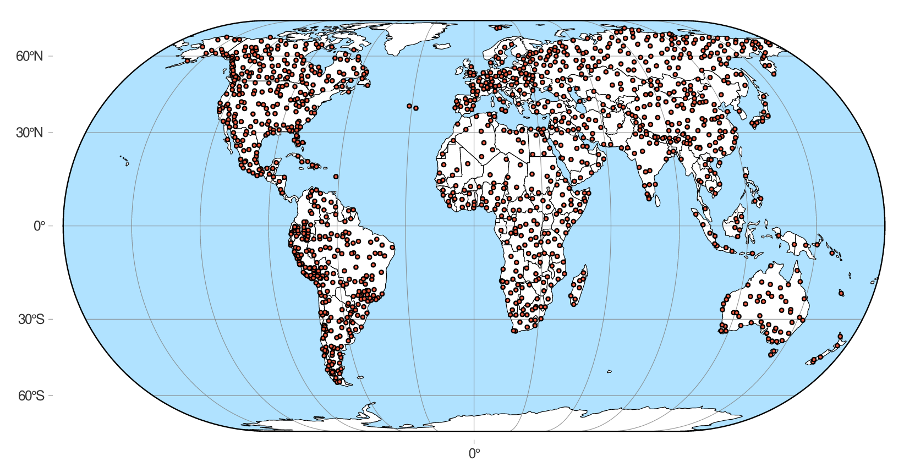
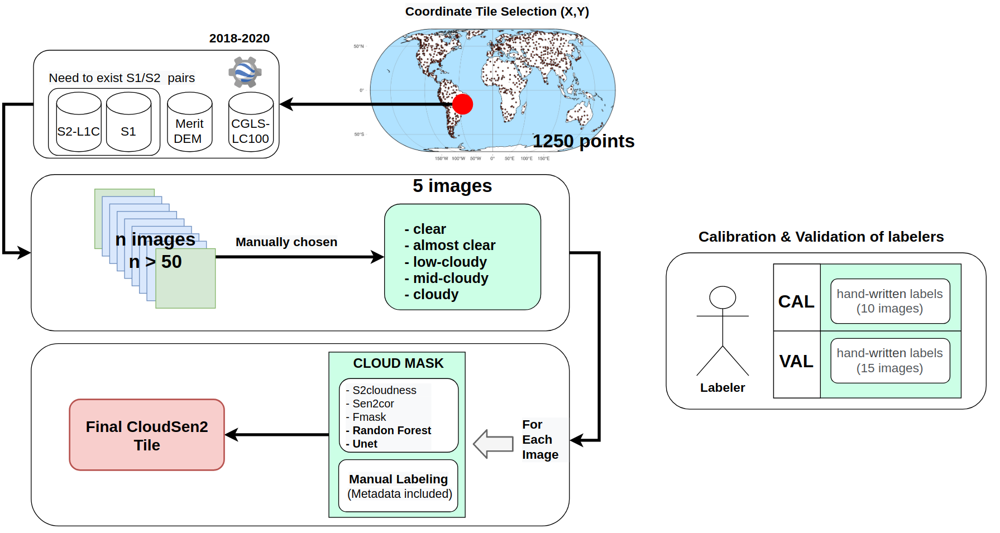

```{r titleslide, child="components/titleslide.Rmd"}
```

```{r setup, include=FALSE}
library(dplyr)
library(kableExtra)
library(formattable)
library(crayon)
knitr::opts_chunk$set(echo = TRUE)
```

---

<center>

</center>

---
# Motivation

* There is no a curated, globally, and georeferenced S2/S1 dataset for cloud segmentation. In our best knowledge, the most advanced is [SEN12MS](https://paperpile.com/app/p/a83e2843-e880-0fb6-99a4-50ded9078482).

--
* Lack of variety of scenes (e.g. avoid haze and cirrus presence). Like [Biome-8](https://landsat.usgs.gov/landsat-8-cloud-cover-assessment-validation-data) and
[SPARCS](https://www.usgs.gov/core-science-systems/nli/landsat/spatial-procedures-automated-removal-cloud-and-shadow-sparcs).

--
* Designed on a regional rather than global scale.

--
* Most of them are only designed for **fully supervised method**
  - optical/radar fusion ([Schmitt et al. 2020](https://paperpile.com/app/p/442c85f2-0c6b-030b-ac59-2d689051edf7)).
  - Meta-learning ([Castillo-Navarro et al. 2020](https://paperpile.com/app/p/a0c84df2-3351-03bb-a770-15764c99152a)).
  - Few-shot learning ([Rußwurm et al. 2020](https://paperpile.com/app/p/69ab0b0c-ea15-0158-bf03-d06f3f9e2fc0)).

--
* I hate clouds >:v.


---
# CloudSEN12 dataset

<br>

<center>

</center>

---
# CloudSEN12 dataset

<br>

<center>

</center>

---
# CloudSEN12

- \> 40000 km2 of surface coverage and ~200GB of data.
- **Global coverage** considering diferents:
  - Types of clouds (contrails, haze/fog, cirrus, cumulus/cumulonimbus), 
  - Cloud height. 
  - Cloud thickness.
  - Land use (CGLS-LC100).
- Each image is composed:
  - 13 Bands from Sentinel2 (+CDI) 
  - 2 bands from Sentinel1 (VV and VH instrument IW).
  - Fmask4.2, sen2cor, s2cloudness, Unet and Random Forest cloud map results.
  - **Expert manual labeling**

---
# CloudSEN12 methodology

<center>

</center>

---
# CloudSEN12 classes

<br>
```{r, echo=FALSE}
text_tbl <- data.frame(
  Method = c("Fmask4.2", "Sen2Cor", "s2cloudness", "Random Forest", "U-net", "CloudSEN12"),
  Classes = c(
    "Clear, Cloud and Cloud Shadow",
    "Clear, Cloud and Cloud Shadow", 
    "Clear and Cloud Shadow",
    "Clear, Thick cloud, Thin cloud, Cloud Shadow",
    "Clear, Thick cloud, Thin cloud, Cloud Shadow",
    "Clear, Thick cloud, Thin cloud, Cloud Shadow"
  )
)

kbl(text_tbl) %>%
  kable_paper(full_width = F) %>%
  column_spec(1, bold = T, border_right = T) %>%
  column_spec(2, bold = F, border_right = T)
```

---
# CloudSEN12 classes

<br>
```{r, echo=FALSE}
text_tbl <- data.frame(
  Class = c("Clear", "Thick cloud", "Thin cloud", "Cloud shadow", "No data"),
  Classes = c(
    "All clear pixels, i.e. without cloud contamination or cloud shadows.",
    "All cloudy pixels covered by thick clouds (does not include semi-transparent or cloud shadows).", 
    "Clouds that are semi-transparent.",
    "All pixels contaminated by cloud shadows (not terrain shadows).",
    "Reserved for no data pixels."
  )
)

kbl(text_tbl) %>%
  kable_paper(full_width = F) %>%
  column_spec(1, bold = T, border_right = T) %>%
  column_spec(2, bold = F, border_right = T)
```

---
# Iris: Intelligence foR Image Segmentation

ESA-Philab tool (created with flask!) for **manual image segmentation** and 
classification of satellite imagery

<br>
<center>

</center>

---
# Tile Image

**input.tif**

  - **B1 to B13:** Sentinel-2.
  - **B14:** CDI.
  - **B15 to B17:** Sentinel-1 (VV, VH and angle).
  - **B18:** Merit DEM.
  - **B19:** CGLS-100 (land use).

**target.tif**

  - **Manual labeling**
  - **Sen2cor**
  - **S2cloudness**
  - **Fmask v4.2**
  - **Random Forest**
  - **Unet**
  
---
# Experiments

<br>

<center>
<b>Fully Convolutional Neural Networl (e.g. <a href="https://paperpile.com/app/p/d5a77b88-8ebf-0d52-b7df-f9b8e836be71"> Høxbroe et al. 2019 </a>)</b>
</center>

<br>

<center>

</center>

---
# Experiments

<br>

<center>
<b>S2 and S1 fusion using Deep Residual Neural Network (e.g. <a href="https://paperpile.com/app/p/4a4e1ac6-5efd-03bf-afd6-9d6eb41655a5"> Andrea et al. 2019 </a>)</b>
</center>

<br>

<center>

</center>

---
# Experiments

<br>

<center>
<b>Meta-learning for Few-shot classification</b>
</center>

<br>

<center>

</center>


---
# Experiments

<br>

**Colorizing Sentinel-1 Image?** <br>

**Land-Use classification?**

---

# Paper structure (early-pre-alpha)

1. Introduction
2. Data and Methods
  - Sentinel-1
  - Sentinel-2
3. The CloudSEN12 dataset
  - Data preparation
  - Data selection
  - Cloud mask models
  - Cloud labeling
  - Image Export
4. Experiments
5. Strengths and limitation of the dataset

---

```{r endslide, child="components/endslide.Rmd"}
```
