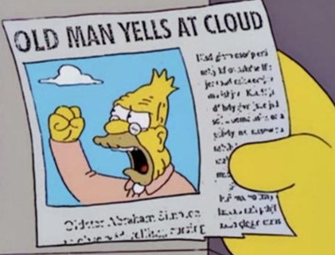
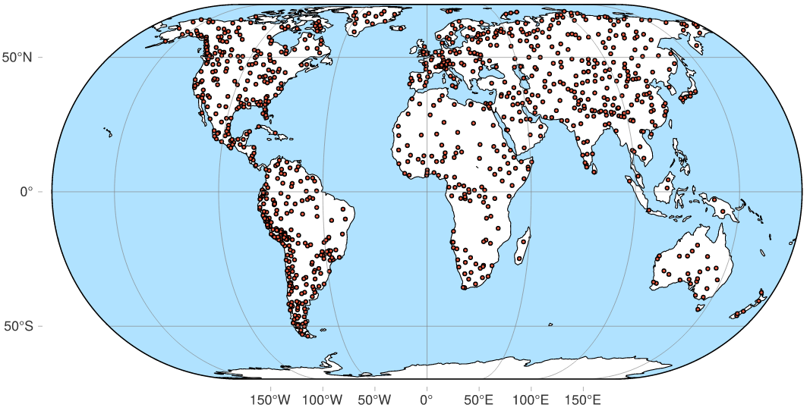
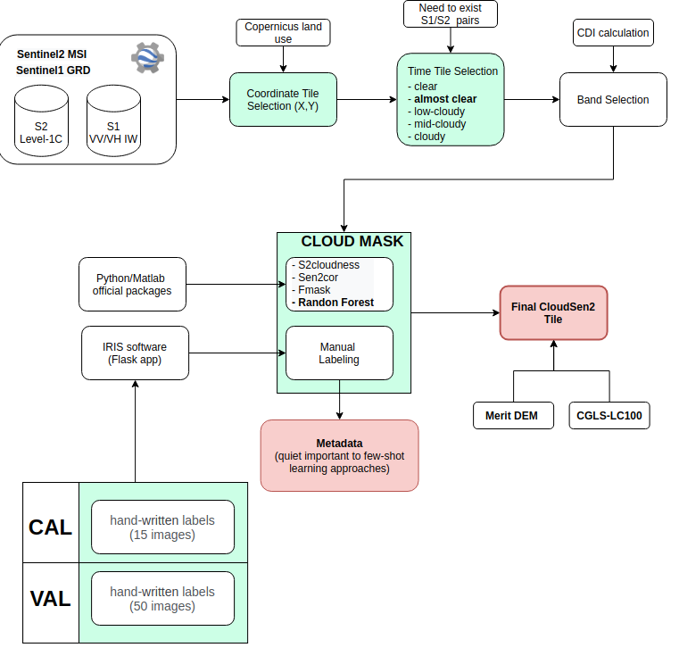
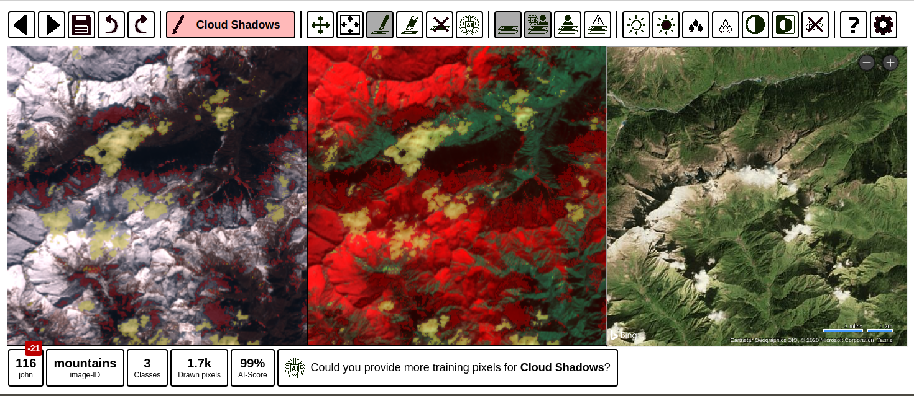
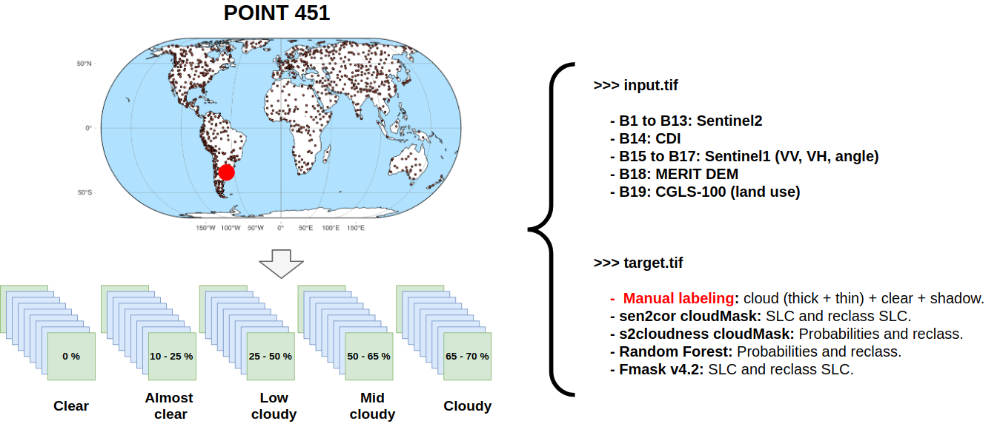
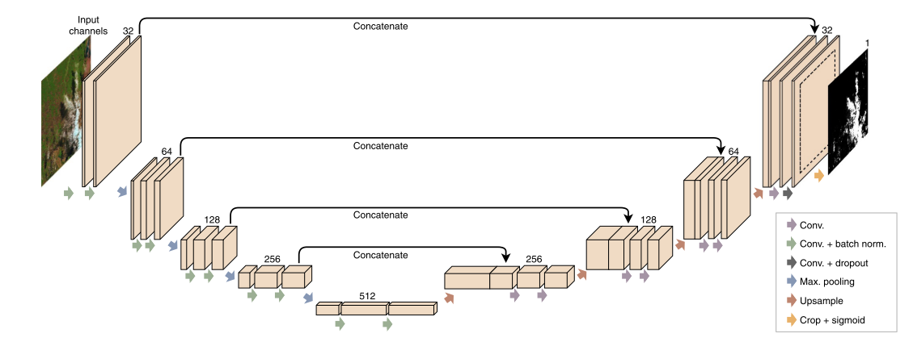
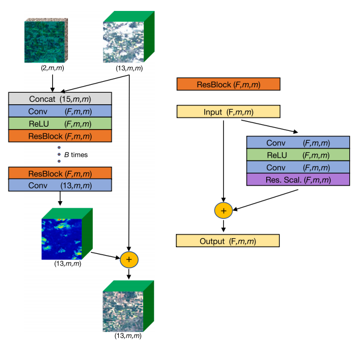
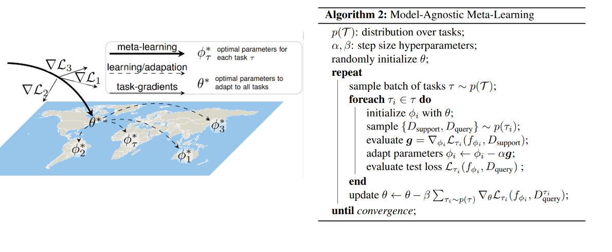

```{r titleslide, child="components/titleslide.Rmd"}
```

---

<center>

</center>

---
# Motivation

* There is no a curated, globally, and georeferenced S2/S1 dataset for cloud segmentation.

--
* Lack of variety of scenes (e.g. avoid haze and cirrus presence). Like [Biome-8](https://landsat.usgs.gov/landsat-8-cloud-cover-assessment-validation-data) and
[SPARCS](https://www.usgs.gov/core-science-systems/nli/landsat/spatial-procedures-automated-removal-cloud-and-shadow-sparcs)

--
* Designed on a regional rather than global scale.

--
* Most of them are only designed for **fully supervised method**
  - optical/radar (S1/S2) fusion.
  - Meta-learning (few shot learning).

--
* I hate clouds >:v.



---
# CloudSEN12 dataset 

<br>

<center>

</center>

---
# CloudSEN12

- Very large dataset for semantic segmentation.
- \> 13000 km2 of surface coverage and ~100GB of data.
- Global coverage considering:
  - Different types of clouds (contrails, haze/fog, cirrus, cumulus/cumulunimbus), 
  cloud height and cloud thickness.
  - 12 land uses considering CGLS-LC100.
- Each image is composed:
  - 13 Bands from Sentinel2 (+CDI) 
  - 2 bands from Sentinel1 (VV and VH instrument IW).
  - Fmask4.2, sen2cor, s2cloudness and Random Forest cloud map results.
  - **Expert manual labeling**

---
# CloudSEN12 methodology

<center>

</center>

---
# Iris: Intelligence foR Image Segmentation

ESA-Philab tool (created with flask!) for **manual image segmentation** and 
classification of satellite imagery

<br>
<center>

</center>

---
# Tile Image
<br>
<center>

</center>

---
# Experiments

<br>

<center>
<b>Fully Convolutional Neural Networl (e.g. <a href="https://paperpile.com/app/p/d5a77b88-8ebf-0d52-b7df-f9b8e836be71"> Høxbroe et al. 2019 </a>)</b>
</center>

<br>

<center>

</center>

---
# Experiments

<br>

<center>
<b>S2 and S1 fusion using Deep Residual Neural Network (e.g. <a href="https://paperpile.com/app/p/4a4e1ac6-5efd-03bf-afd6-9d6eb41655a5"> Andrea et al. 2019 </a>)</b>
</center>

<br>

<center>

</center>

---
# Experiments

<br>

<center>
<b>Meta-learning for Few-shot classification</b>
</center>

<br>

<center>

</center>


---
# Experiments

<br>
<br>

**Colorizing Sentinel-1 Image?** <br>

**Land-Use classification?**

---

# Paper structure (early-pre-alpha)

1. Introduction
2. Data and Methods
  - Sentinel-1
  - Sentinel-2
3. The CloudSEN12 dataset
  - Data preparation
  - Data selection
  - Cloud mask models
  - Cloud labeling
  - Image Export
4. Experiments
5. Strengths and limitation of the dataset

---

class: motivator middle

## has this project the possibility of being published?

---

class: informative middle

## If so, which journal would be recommended?

---

```{r endslide, child="components/endslide.Rmd"}
```
