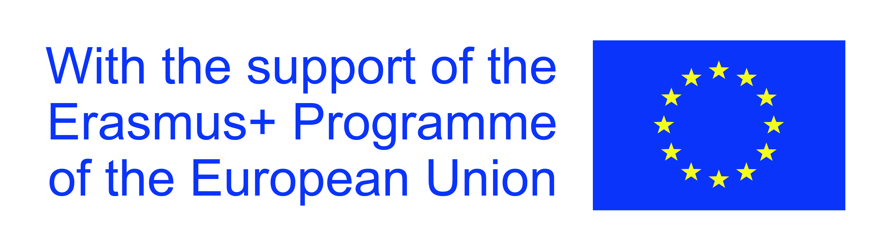
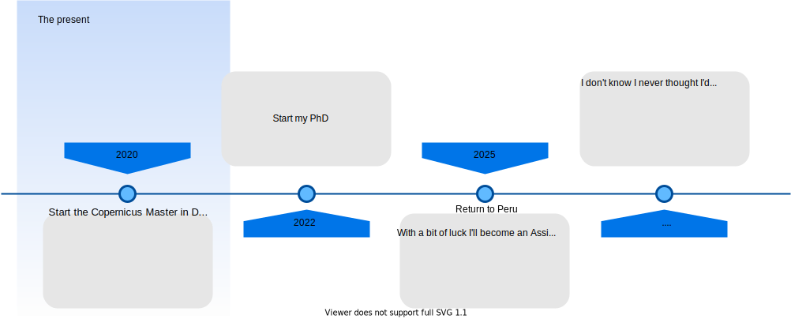

## **Personal Introduction**
<section>
    
    
</section>
<br>
<br>
<br>
<br>
<div class="title">
  
  <h3 class="question"> Name: </h3>
  <h4 class="answer"> Cesar Luis Aybar Camacho <h4> 
  <h3 class="question"> Nationality: </h3>
  <h4 class="answer"> Peruvian </h4>
  <h3 class="question"> Age: </h3>
  <h4 class="answer"> 25 </h4>
  <h3 class="question"> Track: </h3>
  <h4 class="answer"> GeoData Science <h4>
</div>

<center>
[https://csaybar.github.io](https://csaybar.github.io)
</center>

## **Where is Peru?**
```{r, echo=FALSE, warning=FALSE, fig.width=10, fig.height=3, echo=FALSE}
suppressPackageStartupMessages(library(mapview))
suppressPackageStartupMessages(library(sf))

mapviewOptions(
  basemaps = c(
    "Esri.WorldImagery",  "OpenTopoMap", 
    "CartoDB.Positron", "CartoDB.DarkMatter",
    "OpenStreetMap"
  )
)
peru <- st_point(c(-77.09360, -11.96751)) %>% 
  st_sfc(crs = 4326) %>% 
  st_sf(location = "Lima, Peru")
austria <- st_point(c(13.04570, 47.79966)) %>% 
  st_sfc(crs = 4326) %>% 
  st_sf(location = "Salzburg, Austria")

Journey <- st_linestring(
  matrix(
    data = c(-77.09360, 13.04570, -11.96751, 47.79966),
    nrow = 2
  )
) %>% 
  st_sfc(crs = 4326) %>% 
  st_sf(location = "travel")

Legend <- rbind(peru, austria)
m <- mapview(Journey, color = "red",  lwd = 3, legend = FALSE, homebutton = FALSE) +
  mapview(Legend, legend = FALSE, homebutton = FALSE)
m <- addLogo(m, "https://user-images.githubusercontent.com/16768318/84294830-5c52a280-ab0f-11ea-8e06-12f55c6781c9.png",
        position = "bottomright",
        offset.x = 50,
        offset.y = 50,
        width = 120,
        height = 40)
m
```


- It is a multicultural nation.
- It is home to 84 of the planet’s 117 life zones. 
- Its enormous territory, is composed of three regions: 
  - Pacific coast (< 100 mm/year).
  - Andean highlands (~ 1500 mm/year).
  - Amazon RainForest (~ 4000 mm/year).   

## {data-background="static/img/03_peru.jpg"}

## **My Academic Journey**
<br>
<br>


## **Motivation**

## **Motivation**

<br>

- Expand my knowledge
  - Computer vision
  - Deep Learning
  - Earth Observation
  - Scientific writing skills
  
## **Motivation**

<br>

- Expand my knowledge
  - Computer vision
  - Deep Learning
  - Earth Observation
  - Scientific writing skills
- Networking.

## **Motivation**

<br>

- Expand my knowledge
  - Computer vision
  - Deep Learning
  - Earth Observation
  - Scientific writing skills
- Networking.
- Speaking English all day long (shy + not very confident English speaker = fatal combination)

## **Outlook**
<br>
<br>


# **Muchas gracias por escuchar**

<br>
<br>
<center>


</center>
